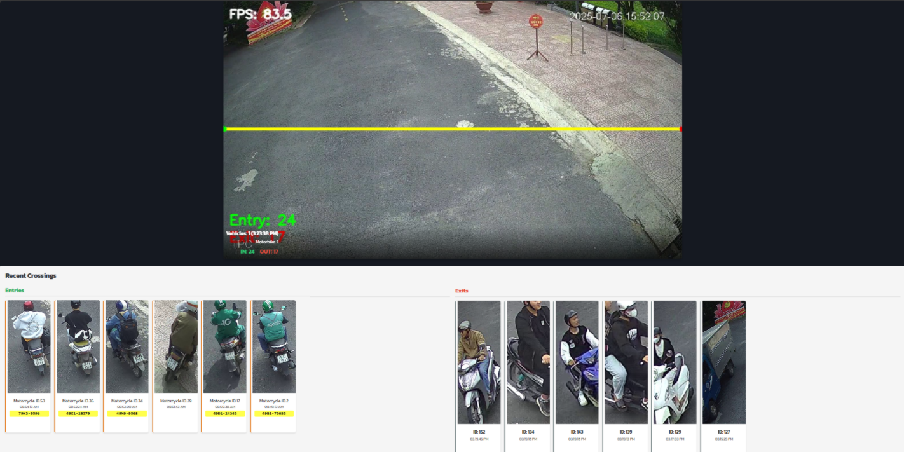
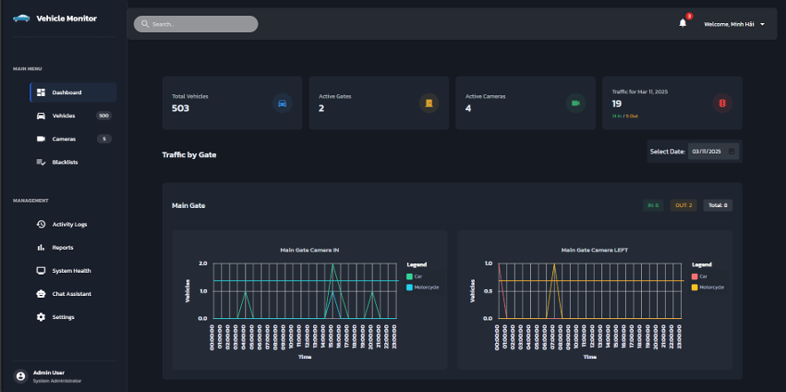
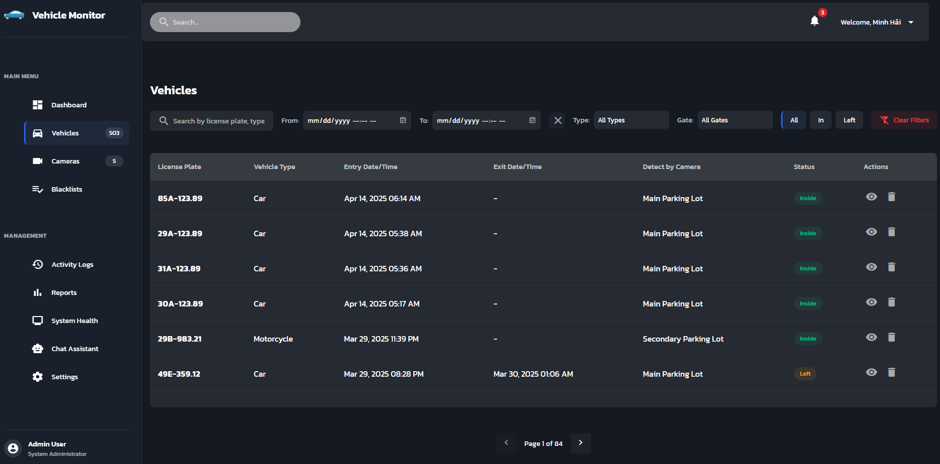
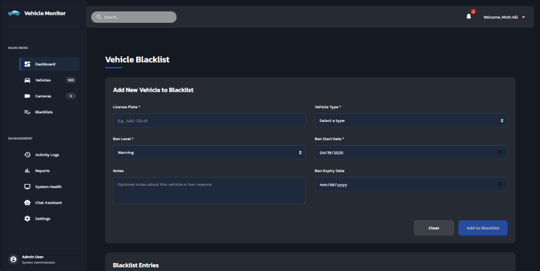
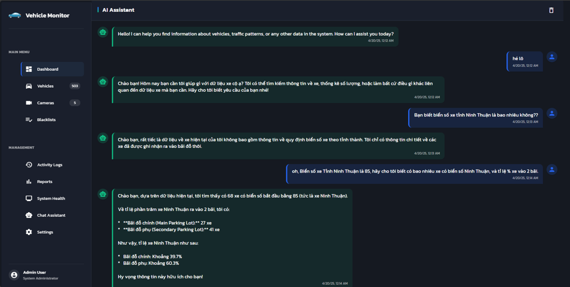
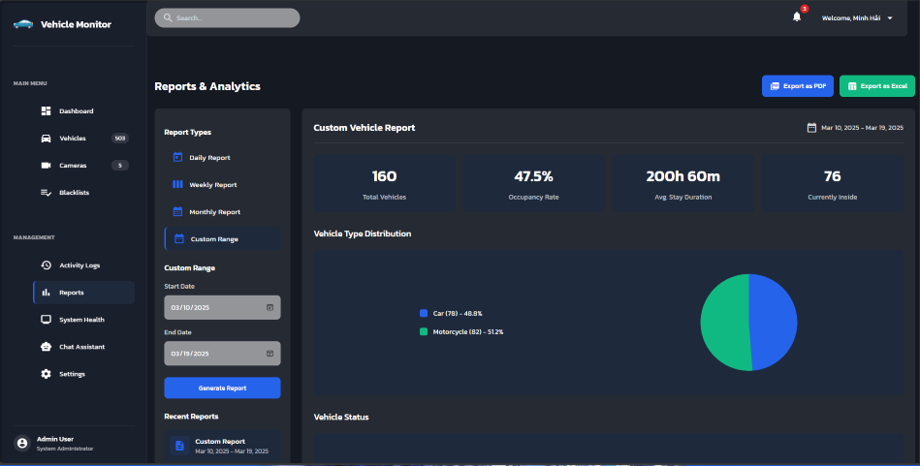
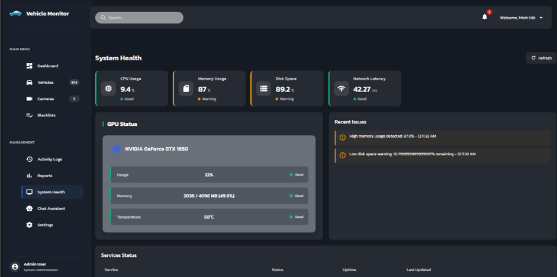

<h1 align="center">
  🚗 Vehicle Monitor<br/>
  <sub>Intelligent Parking & Traffic Surveillance Platform</sub>
</h1>

<p align="center">
  <em>AI-powered real-time vehicle detection, license plate recognition & fleet management — built with YOLOv8, WebRTC, and Angular</em>
</p>

<p align="center">
  <a href="#-quick-start"></a>
  <a href="#-features"></a>
  <a href="#-architecture"></a>
  <a href="#-tech-stack"></a>
</p>

<p align="center">
  
  
  
  
  
  
  
  
  
  
  
</p>

<br/>

<!-- HERO BANNER -->
<p align="center">
  
</p>
<p align="center"><sub>📸 <i>Live Monitoring — Phát hiện phương tiện real-time qua camera IP với AI bounding boxes, nhận dạng biển số và cảnh báo xe vi phạm</i></sub></p>

---

## 📋 Mục Lục

<details>
<summary>🔍 Nhấn để mở rộng</summary>

- [✨ Giới Thiệu](#-giới-thiệu)
- [🎯 Bài Toán Giải Quyết](#-bài-toán-giải-quyết)
- [🚀 Features](#-features)
- [🤖 AI/CV Pipeline](#-aicv-pipeline)
- [🏗️ System Architecture](#️-system-architecture)
- [⚡ Tech Stack](#-tech-stack)
- [📸 Screenshots](#-screenshots)
- [🏁 Quick Start](#-quick-start)
- [📁 Project Structure](#-project-structure)
- [🔌 API Documentation](#-api-documentation)
- [📡 Real-time Communication](#-real-time-communication)
- [🗺️ Detection Models](#️-detection-models)
- [🧪 Testing](#-testing)
- [🔮 Roadmap](#-roadmap)
- [📄 License](#-license)

</details>

---

## ✨ Giới Thiệu

**Vehicle Monitor** là một hệ thống giám sát phương tiện giao thông thông minh, sử dụng **Computer Vision** và **Deep Learning** để phát hiện, theo dõi và nhận dạng biển số xe **theo thời gian thực** từ camera IP (RTSP).

Hệ thống tích hợp **4 mô hình YOLO** chạy trên GPU, truyền video qua **WebRTC** với độ trễ cực thấp, và cung cấp **AI chatbot (Google Gemini)** cho phân tích dữ liệu thông minh.

> 🎓 *Đồ Án Tốt Nghiệp — Xây dựng hệ thống giám sát phương tiện giao thông thông minh ứng dụng trí tuệ nhân tạo*

---

## 🎯 Bài Toán Giải Quyết

<table>
<tr>
<td width="60">❌</td>
<td width="40%"><b>Vấn đề</b></td>
<td width="60">✅</td>
<td width="40%"><b>Giải pháp</b></td>
</tr>
<tr>
<td>🚫</td>
<td>Giám sát bãi xe bằng nhân lực, chi phí cao</td>
<td>🤖</td>
<td>AI tự động phát hiện & ghi nhận xe ra/vào 24/7</td>
</tr>
<tr>
<td>🚫</td>
<td>Không nhận dạng được biển số tự động</td>
<td>📷</td>
<td>3-stage YOLO pipeline: detect → preprocess → OCR</td>
</tr>
<tr>
<td>🚫</td>
<td>Khó phát hiện xe vi phạm, xe gian kịp thời</td>
<td>🚨</td>
<td>Blacklist real-time với cảnh báo âm thanh tức thì</td>
</tr>
<tr>
<td>🚫</td>
<td>Video IP camera lag, khó xem từ xa</td>
<td>📡</td>
<td>WebRTC streaming với H.264, 5Mbps, < 500ms latency</td>
</tr>
<tr>
<td>🚫</td>
<td>Báo cáo & thống kê thủ công</td>
<td>📊</td>
<td>Dashboard tự động + Export PDF/Excel + AI phân tích</td>
</tr>
</table>

---

## 🚀 Features

<table>
<tr>
<td width="50%">

### 📹 Live Video Monitoring
- **WebRTC Streaming** — Video từ camera IP (RTSP) → WebRTC với < 500ms delay
- **AI Detection Overlay** — Bounding boxes vẽ trực tiếp trên canvas real-time
- **Color-coded Labels** — Phân loại xe theo màu (🔵 Car · 🟠 Motorcycle · 🔴 Bus · 🟣 Truck)
- **FPS & Quality Monitor** — Theo dõi FPS, packet loss, jitter liên tục
- **Auto-reconnect** — Exponential backoff khi mất kết nối

</td>
<td width="50%">

### 🤖 AI Vehicle Detection (YOLOv8)
- **Multi-model Pipeline** — 4 mô hình YOLO chạy song song trên GPU
- **Advanced Tracker** — IoU + center distance matching với Kalman prediction
- **Line-crossing Detection** — Đếm xe ra/vào qua vạch ảo thông minh
- **Singleton Service** — AI chạy 24/7 độc lập, không phụ thuộc client
- **Dual Resolution** — 384px cho AI processing, 800px cho display

</td>
</tr>
<tr>
<td width="50%">

### 🔢 License Plate Recognition
- **3-stage Pipeline** — Plate detection → Preprocessing → Character OCR
- **Vietnamese Plates** — Hỗ trợ biển 1 dòng & 2 dòng (VD: `51C-195.31`)
- **Image Enhancement** — CLAHE + Deskewing + Super-resolution (RealESRGAN)
- **Quality Scoring** — Laplacian variance + brightness + size assessment
- **Auto-capture** — Chụp biển số tại thời điểm tối ưu nhất

</td>
<td width="50%">

### 🚨 Blacklist & Alert System
- **Real-time Matching** — Cross-check biển số với blacklist mỗi frame
- **Full-screen Alert** — Modal toàn màn hình với hiệu ứng đỏ nhấp nháy
- **Alarm Sound** — Phát âm thanh cảnh báo tự động
- **Ban Levels** — 2 cấp độ: ⚠️ Warning / 🚫 Ban
- **Expiry Management** — Quản lý ngày hết hạn lệnh cấm

</td>
</tr>
<tr>
<td width="50%">

### 📊 Dashboard & Analytics
- **KPI Cards** — Tổng xe, cổng hoạt động, camera, lưu lượng
- **Interactive Charts** — Biểu đồ lưu lượng xe theo giờ (ngx-charts)
- **Gate Analytics** — Thống kê riêng từng cổng (Main/Secondary, IN/OUT)
- **Date Picker** — Xem dữ liệu theo ngày tùy chọn
- **Export** — Xuất báo cáo **PDF** (html2canvas) & **Excel** (ExcelJS, 6 sheets)

</td>
<td width="50%">

### 🧠 AI Chatbot (Gemini 2.0 Flash)
- **Natural Language Query** — Hỏi bằng tiếng Việt tự nhiên
- **Context-aware** — AI truy cập toàn bộ dữ liệu xe trong DB
- **Conversation Memory** — Lưu lịch sử hội thoại
- **Smart Analysis** — Phân tích xu hướng, dự đoán, tư vấn
- **Typing Indicator** — Hiệu ứng AI đang trả lời

</td>
</tr>
<tr>
<td width="50%">

### 🖥️ System Health Monitoring
- **CPU / Memory / Disk** — Giám sát tài nguyên server real-time
- **GPU Monitoring** — NVIDIA GPU usage, memory, temperature (pynvml)
- **Network Latency** — Kiểm tra băng thông & ping
- **Service Status** — Trạng thái: 🟢 Online / 🟡 Degraded / 🔴 Offline
- **Auto-refresh** — Cập nhật mỗi 30 giây

</td>
<td width="50%">

### 🏢 Fleet Management
- **Vehicle CRUD** — Quản lý thông tin phương tiện đầy đủ
- **Gate Management** — Quản lý cổng ra/vào
- **Camera Management** — Cấu hình camera IP
- **Activity Logs** — Lịch sử hoạt động chi tiết
- **Report Generation** — Báo cáo Daily/Weekly/Monthly/Custom

</td>
</tr>
</table>

---

## 🤖 AI/CV Pipeline

### Detection Flow

```
┌──────────────────────────────────────────────────────────────────────────────────┐
│                         🎯 DETECTION SERVICE (Singleton, GPU)                    │
│                                                                                  │
│  ┌─────────┐    ┌──────────┐    ┌──────────────┐    ┌─────────────────────────┐  │
│  │  RTSP   │    │  Frame   │    │   YOLOv8     │    │   Advanced Tracker     │  │
│  │ Camera  │───►│ Capture  │───►│  Vehicle     │───►│  (IoU + Distance +     │  │
│  │ 2688×   │    │ OpenCV   │    │  Detection   │    │   Velocity Predict)    │  │
│  │ 1520    │    │ H.265    │    │  (GPU)       │    │                        │  │
│  └─────────┘    └──────────┘    └──────────────┘    └───────────┬─────────────┘  │
│                                                                 │                │
│                                                     ┌───────────▼─────────────┐  │
│                                                     │  Smart Line-Crossing    │  │
│                                                     │  Detector (40% height)  │  │
│                                                     └───────────┬─────────────┘  │
│                                                                 │                │
│                                        ┌────────────────────────┤                │
│                                        │ [Vehicle Crossed Line] │                │
│                                        ▼                        ▼                │
│                              ┌──────────────────┐    ┌──────────────────────┐    │
│                              │  Plate Detector  │    │  MongoDB Save        │    │
│                              │  (YOLO, 6.2MB)   │    │  (Background Queue)  │    │
│                              └────────┬─────────┘    └──────────────────────┘    │
│                                       │                                          │
│                              ┌────────▼─────────┐                                │
│                              │  CLAHE + Deskew  │                                │
│                              │  Image Enhance   │                                │
│                              └────────┬─────────┘                                │
│                                       │                                          │
│                              ┌────────▼─────────┐                                │
│                              │  Plate OCR       │    ┌─── "51C-195.31" ──────┐   │
│                              │  (YOLO, 5.5MB)   │───►│  License Plate Result │   │
│                              └──────────────────┘    └───────────────────────┘   │
│                                                                                  │
└──────────────────────────────────────────────────────────────────────────────────┘
```

### YOLO Models

| Model | Size | Purpose | Resolution |
|:------|:----:|:--------|:----------:|
| `vehicle_detector.pt` | 136 MB | Phát hiện phương tiện (Car, Bus, Motorbike) | 384px |
| `plate_detector.pt` | 6.2 MB | Phát hiện vùng biển số | 640px |
| `plate_recognizer.pt` | 5.5 MB | Nhận dạng ký tự trên biển | 640px |
| `yolo11x.pt` | 114 MB | Phát hiện đối tượng chung (người) | 640px |

### Advanced Tracker

```python
# Thuật toán Matching (mỗi frame):
1. Tính IoU matrix giữa detections & existing tracks
2. Tính Center Distance matrix (normalized)
3. Combined Score = α × IoU + β × Distance
4. Hungarian Algorithm → Optimal Assignment
5. Kalman-like Velocity Prediction cho unmatched tracks
6. Track lifecycle: Created → Active → Lost → Deleted
```

---

## 🏗️ System Architecture

```
┌─────────────────────────────────────────────────────────────────────────┐
│                          🌐 CLIENT LAYER                                │
│                                                                         │
│  ┌───────────────────────────────────────────────────────────────────┐  │
│  │                      Angular 19 SPA                               │  │
│  │                                                                   │  │
│  │  ┌──────────┐  ┌──────────┐  ┌───────────┐  ┌────────────────┐  │  │
│  │  │ 📹 Video │  │ 📊 Dash- │  │ 🚗 Fleet  │  │  🤖 AI Chat   │  │  │
│  │  │ Monitor  │  │  board   │  │  Manage   │  │   (Gemini)     │  │  │
│  │  │ (WebRTC  │  │(ngx-char │  │ (Angular  │  │                │  │  │
│  │  │ +Canvas) │  │ ts)      │  │ Material) │  │                │  │  │
│  │  └────┬─────┘  └────┬─────┘  └─────┬─────┘  └──────┬─────────┘  │  │
│  │       │              │              │               │            │  │
│  │  ┌────▼──────────────▼──────────────▼───────────────▼─────────┐  │  │
│  │  │              Services Layer (HttpClient + RxJS)             │  │  │
│  │  │     REST API    ←──→    WebSocket (WebRTC Signaling)       │  │  │
│  │  └──────────────────────────┬─────────────────────────────────┘  │  │
│  └─────────────────────────────┼─────────────────────────────────────┘  │
└────────────────────────────────┼────────────────────────────────────────┘
                                 │
              ───────────────────┼───────────────────
             │  HTTP REST  │  WebSocket  │  WebRTC   │
              ───────────────────┼───────────────────
                                 │
┌────────────────────────────────┼────────────────────────────────────────┐
│                          🖥️ SERVER LAYER                                │
│                                                                         │
│  ┌─────────────────────────────▼──────────────────────────────────────┐ │
│  │             Django 5 + DRF + Channels (Daphne ASGI)               │ │
│  │                                                                    │ │
│  │  ┌────────────────┐  ┌──────────────────┐  ┌───────────────────┐  │ │
│  │  │   REST API     │  │ VideoConsumer    │  │ DetectionService  │  │ │
│  │  │                │  │ (WebSocket)      │  │ (Singleton)       │  │ │
│  │  │ • Vehicles     │  │                  │  │                   │  │ │
│  │  │ • Gates        │  │ • WebRTC Signal  │  │ • RTSP Capture    │  │ │
│  │  │ • Cameras      │  │ • SDP Exchange   │  │ • YOLO Detection  │  │ │
│  │  │ • Logs         │  │ • ICE Candidates │  │ • Object Tracking │  │ │
│  │  │ • Reports      │  │ • Detection Push │  │ • Line Crossing   │  │ │
│  │  │ • Blacklists   │  │                  │  │ • Plate OCR       │  │ │
│  │  │ • System Health│  │ • Video Stream   │  │ • DB Write Queue  │  │ │
│  │  │ • AI Chat      │  │   (aiortc)       │  │                   │  │ │
│  │  └───────┬────────┘  └────────┬─────────┘  └────────┬──────────┘  │ │
│  │          │                    │                      │             │ │
│  │  ┌───────▼────────────────────▼──────────────────────▼──────────┐  │ │
│  │  │                      DATA LAYER                              │  │ │
│  │  │                                                              │  │ │
│  │  │  ┌────────────┐  ┌──────────────┐  ┌──────────────────────┐ │  │ │
│  │  │  │  MongoDB   │  │  Firebase    │  │  Google Gemini AI    │ │  │ │
│  │  │  │  (Primary) │  │  Auth/Cloud  │  │  2.0 Flash           │ │  │ │
│  │  │  │            │  │              │  │                      │ │  │ │
│  │  │  │ vehicles   │  │ Credentials  │  │  Smart Analysis      │ │  │ │
│  │  │  │ gates      │  │ & Auth       │  │  NL Query            │ │  │ │
│  │  │  │ cameras    │  │              │  │  Context Injection   │ │  │ │
│  │  │  │ logs       │  │              │  │                      │ │  │ │
│  │  │  │ reports    │  │              │  │                      │ │  │ │
│  │  │  │ blacklists │  │              │  │                      │ │  │ │
│  │  │  └────────────┘  └──────────────┘  └──────────────────────┘ │  │ │
│  │  └──────────────────────────────────────────────────────────────┘  │ │
│  └────────────────────────────────────────────────────────────────────┘ │
│                                                                         │
│  ┌────────────────────────────────────────────────────────────────────┐ │
│  │  🎥 IP CAMERAS (RTSP)                                             │ │
│  │  Dahua • 2688×1520 • H.265 • 20fps • TCP Transport               │ │
│  └────────────────────────────────────────────────────────────────────┘ │
└─────────────────────────────────────────────────────────────────────────┘
```

### 🔄 Real-time Data Flow

```
  IP Camera (RTSP)          Django Backend                Angular Frontend
       │                         │                              │
       │── H.265 Stream ────────►│                              │
       │                         │                              │
       │                    DetectionService                    │
       │                    (Background Thread)                 │
       │                         │                              │
       │                    ┌────▼─────┐                        │
       │                    │ YOLOv8   │                        │
       │                    │ Detect + │                        │
       │                    │ Track    │                        │
       │                    └────┬─────┘                        │
       │                         │                              │
       │                    ┌────▼──────────┐                   │
       │                    │ Line Crossing │                   │
       │                    │ + Plate OCR   │                   │
       │                    └────┬──────────┘                   │
       │                         │                              │
       │                         ├── Save to MongoDB ──► 💾     │
       │                         │                              │
       │                         │── WebRTC Video ─────────────►│── Render on Canvas
       │                         │── WS Detection Data ────────►│── Draw Bounding Boxes
       │                         │                              │── Check Blacklist
       │                         │                              │── Update Dashboard
       │                         │                              │
       │                         │◄── WS Subscribe ─────────────│
       │                         │                              │
```

---

## ⚡ Tech Stack

### 🤖 AI / Computer Vision

| Technology | Purpose |
|:---:|:---|
|  | Vehicle detection + Plate detection + Character OCR |
|  | Frame capture, preprocessing, annotation, CLAHE enhancement |
| -EE4C2C?style=flat-square&logo=pytorch&logoColor=white) | GPU-accelerated model inference |
|  | Image super-resolution for plate enhancement |
|  | Multi-object tracking with re-identification |

### 🎨 Frontend

| Technology | Version | Purpose |
|:---:|:---:|:---|
|  | 19.0 | Core SPA framework (Standalone components) |
|  | 19.2 | UI components (Dialog, Table, Forms) |
|  | 5.6 | Type-safe development |
|  | 22.0 | Interactive line & bar charts |
|  | 4.4 | Data visualization |
|  | Native | Low-latency video streaming |
|  | 3.0 | PDF & Excel report export |

### 🖥️ Backend

| Technology | Version | Purpose |
|:---:|:---:|:---|
|  | 5.1+ | Web framework |
|  | 3.x | REST API |
|  | 4.x | WebSocket & ASGI server |
|  | — | Server-side WebRTC |
|  | — | Primary database |
|  | — | Authentication & cloud services |
|  | 2.0 | AI chatbot & data analysis |
|  | — | System & GPU health monitoring |

### 🧰 Infrastructure

| Tool | Purpose |
|:---:|:---|
|  | Primary data store (Firestore-compatible wrapper) |
|  | Channel layer (optional) |
|  | GPU acceleration for YOLO inference |
|  | Version control |

---

## 📸 Screenshots

> 💡 **Thay thế đường dẫn ảnh bên dưới bằng screenshots thực tế của bạn**
>
> Tạo thư mục `docs/images/` và chụp ảnh từng trang của ứng dụng.

<details>
<summary>📹 <b>Live Video Monitoring</b> — Trang giám sát chính</summary>
<br/>
<p align="center">
  
</p>
<p align="center"><sub>
  <i>Video stream real-time từ camera IP với AI bounding boxes (xe ô tô: 🔵 xanh, xe máy: 🟠 cam), vạch đếm xe (cyan), FPS counter, và chỉ báo chất lượng mạng. Biển số xe được nhận dạng tự động khi xe vượt qua vạch đếm.</i>
</sub></p>
</details>

<details>
<summary>📊 <b>Dashboard</b> — Tổng quan & biểu đồ</summary>
<br/>
<p align="center">
  
</p>
<p align="center"><sub>
  <i>Dashboard với 4 KPI cards, 4 biểu đồ lưu lượng xe theo giờ (Main Gate IN/OUT, Secondary Gate IN/OUT) phân loại Car/Motorcycle, bảng hoạt động gần nhất, và nhật ký hệ thống. Sidebar collapsible bên trái với glassmorphism dark theme.</i>
</sub></p>
</details>

<details>
<summary>🚗 <b>Vehicle Management</b> — Quản lý phương tiện</summary>
<br/>
<p align="center">
  
</p>
<p align="center"><sub>
  <i>Danh sách phương tiện với phân trang (6/trang), bộ lọc theo trạng thái (Inside/Left/Exited), loại xe, cổng, ngày. Click vào xe để xem chi tiết trong Material Dialog.</i>
</sub></p>
</details>

<details>
<summary>🚨 <b>Blacklist Alert</b> — Cảnh báo xe vi phạm</summary>
<br/>
<p align="center">
  
</p>
<p align="center"><sub>
  <i>Khi camera phát hiện xe trong blacklist: modal toàn màn hình với hiệu ứng đỏ nhấp nháy (pulsing glow), âm thanh cảnh báo, ảnh xe, biển số, lý do bị cấm. Tự động trigger từ license plate matching real-time.</i>
</sub></p>
</details>

<details>
<summary>🤖 <b>AI Chat</b> — Chatbot phân tích dữ liệu</summary>
<br/>
<p align="center">
  
</p>
<p align="center"><sub>
  <i>Giao diện chat với Google Gemini 2.0 Flash. Hỏi bằng tiếng Việt tự nhiên: "Có bao nhiêu xe đã vào bãi hôm nay?", "Thống kê xe máy vs ô tô tuần này". AI truy vấn database và trả lời thông minh.</i>
</sub></p>
</details>

<details>
<summary>📈 <b>Reports</b> — Báo cáo & xuất file</summary>
<br/>
<p align="center">
  
</p>
<p align="center"><sub>
  <i>Tạo báo cáo Daily/Weekly/Monthly/Custom range. Thống kê: phân bổ loại xe, trạng thái, thời gian đỗ trung bình, giờ cao điểm, tỷ lệ lấp đầy. Export ra PDF (multi-page) hoặc Excel (6 worksheets).</i>
</sub></p>
</details>

<details>
<summary>🖥️ <b>System Health</b> — Giám sát hệ thống</summary>
<br/>
<p align="center">
  
</p>
<p align="center"><sub>
  <i>Giám sát real-time: CPU usage, RAM, Disk, Network latency. GPU: tên card, usage %, memory, nhiệt độ. Trạng thái services: 🟢 Online / 🟡 Degraded / 🔴 Offline. Auto-refresh mỗi 30 giây.</i>
</sub></p>
</details>

---

## 🏁 Quick Start

### 📋 Prerequisites

| Requirement | Version | Note |
|:---|:---:|:---|
| **Python** | ≥ 3.10 | With pip |
| **Node.js** | ≥ 18.x | With npm |
| **MongoDB** | ≥ 6.x | Running locally or Atlas |
| **NVIDIA GPU** | CUDA capable | For YOLO inference (optional, falls back to CPU) |
| **Angular CLI** | ≥ 19.x | `npm i -g @angular/cli` |

### ⚙️ Installation

**1️⃣ Clone the repository**

```bash
git clone https://github.com/<your-username>/vehicle-monitor.git
cd vehicle-monitor
```

**2️⃣ Backend Setup**

```bash
cd backend

# Tạo & kích hoạt virtual environment
python -m venv venv
venv\Scripts\activate          # Windows
# source venv/bin/activate     # macOS/Linux

# Cài đặt dependencies
pip install -r requirements.txt

# Cấu hình environment
cp .env.example .env
```

Chỉnh sửa `.env`:
```env
# Django
DEBUG=True
SECRET_KEY=your-secret-key

# Firebase
FIREBASE_CREDENTIALS_PATH=API/credentials/your-firebase-key.json

# Google Gemini AI
GEMINI_API_KEY=your-gemini-api-key

# MongoDB
MONGODB_URI=mongodb://localhost:27017
MONGODB_DB=vehicle_monitor
```

```bash
# Chạy migrations (Django admin)
python manage.py migrate

# (Tùy chọn) Tạo dữ liệu mẫu — 500 vehicles, 2 gates, 4 cameras
python ../generate_fake_data.py

# Khởi chạy ASGI server
python manage.py runserver
# hoặc dùng Daphne:
daphne -b 0.0.0.0 -p 8000 backend.asgi:application
```

**3️⃣ Frontend Setup**

```bash
cd frontend

# Cài đặt dependencies
npm install

# Khởi chạy development server
ng serve --open
```

**4️⃣ Access the application**

| Service | URL | Protocol |
|:--------|:----|:---------|
| 🌐 Frontend | [`http://localhost:4200`](http://localhost:4200) | HTTP |
| 🖥️ Backend API | [`http://localhost:8000/api/`](http://localhost:8000/api/) | REST |
| 📡 WebSocket | `ws://localhost:8000/ws/signaling/` | WebSocket |
| 📹 WebRTC | Via WebSocket signaling | WebRTC |

---

## 📁 Project Structure

```
vehicle-monitor/
│
├── 🎨 frontend/                          # Angular 19 SPA
│   ├── src/app/
│   │   ├── video/                        # 📹 Live Video Monitoring (WebRTC + Canvas)
│   │   ├── banned-vehicle-alert/         # 🚨 Full-screen banned vehicle alert modal
│   │   ├── dashboard/                    # 📊 Dashboard layout shell
│   │   │   ├── sidebar/                  #    └─ Collapsible sidebar navigation
│   │   │   ├── dashboard-home/           #    └─ KPI cards + charts + activity table
│   │   │   ├── vehicles/                 #    └─ Vehicle CRUD + filters + pagination
│   │   │   ├── vehicle-details-modal/    #    └─ Vehicle detail dialog
│   │   │   ├── cameras/                  #    └─ Camera management
│   │   │   ├── logs/                     #    └─ Activity log viewer + blacklist check
│   │   │   ├── reports/                  #    └─ Report generation + PDF/Excel export
│   │   │   ├── blacklist/                #    └─ Banned vehicle management (CRUD)
│   │   │   ├── system-health/            #    └─ Server & GPU health monitoring
│   │   │   ├── chat/                     #    └─ AI chatbot (Gemini)
│   │   │   └── settings/                 #    └─ System settings (tabs)
│   │   ├── services/                     # 🔧 API services (Dashboard, Vehicle, AI, Health)
│   │   ├── shared/
│   │   │   ├── models/                   #    └─ TypeScript interfaces
│   │   │   └── services/                 #    └─ Theme, Notification, Cache services
│   │   └── auth/                         # 🔐 Auth service
│   ├── assets/                           # 🎵 alarm.mp3, logo.png, test.mp4
│   └── angular.json                      # Angular CLI configuration
│
├── 🖥️ backend/                           # Django 5 + DRF + Channels
│   ├── API/                              # REST API layer
│   │   ├── views.py                      #    └─ ViewSets (604 lines)
│   │   ├── serializers.py                #    └─ DRF Serializers
│   │   ├── mongodb_config.py             #    └─ MongoDB + Firestore-compat wrapper
│   │   ├── firebase_config.py            #    └─ Firebase Admin SDK init
│   │   └── credentials/                  #    └─ Firebase service account key
│   ├── backend/
│   │   ├── consumers/
│   │   │   └── consumers.py              # 📡 WebRTC/WebSocket consumer (961 lines)
│   │   ├── core/
│   │   │   ├── detection_service.py      # 🤖 Singleton AI pipeline (393 lines)
│   │   │   ├── vehicle_detection.py      # 🚗 YOLO vehicle detector
│   │   │   ├── tracker.py               # 🎯 Advanced multi-object tracker
│   │   │   ├── plate_recognition.py      # 🔢 License plate OCR pipeline
│   │   │   └── line_crossing.py          # 📏 Smart line-crossing detector (540 lines)
│   │   ├── config/
│   │   │   └── settings.py               # ⚙️ YOLO model loading (4 models, GPU)
│   │   └── utils/
│   │       └── mongodb_utils.py           # 💾 Background DB write worker
│   ├── models/                           # 🧠 Pre-trained model weights (.pt, .pb, .pth)
│   ├── settings.py                       # Django settings (Daphne, Channels, CORS)
│   ├── routing.py                        # WebSocket URL routing
│   ├── asgi.py                           # ASGI application entry
│   └── requirements.txt                  # Python dependencies
│
├── 📊 generate_fake_data.py              # Seed data generator (500 vehicles)
└── 📖 README.md                          # ← You are here!
```

---

## 🔌 API Documentation

### Endpoints Overview

<details>
<summary>🚗 <b>Vehicles</b></summary>

```http
GET    /api/vehicles/                      # Danh sách tất cả phương tiện
POST   /api/vehicles/                      # Thêm phương tiện mới
GET    /api/vehicles/<vehicle_id>/         # Chi tiết phương tiện
PUT    /api/vehicles/<vehicle_id>/         # Cập nhật phương tiện
DELETE /api/vehicles/<vehicle_id>/         # Xóa phương tiện
GET    /api/vehicles/by-status/?status=    # Lọc theo trạng thái (Inside/Left/Exited)
```

**Vehicle Schema:**
```json
{
  "vehicle_id": "auto-generated",
  "license_plate": "51C-195.31",
  "vehicle_type": "Car | Motorcycle | Bus | Truck",
  "entry_time": "2024-01-15T08:30:00Z",
  "exit_time": "2024-01-15T17:45:00Z",
  "location": "Main Parking Lot",
  "status": "Inside | Left | Exited",
  "image_url": "https://...",
  "gate_id": "gate-001"
}
```
</details>

<details>
<summary>🏢 <b>Gates & Cameras</b></summary>

```http
GET    /api/gates/                         # Danh sách cổng
POST   /api/gates/                         # Thêm cổng
GET    /api/cameras/                       # Danh sách camera
POST   /api/cameras/                       # Thêm camera
```
</details>

<details>
<summary>📋 <b>Logs & Reports</b></summary>

```http
GET    /api/logs/by-date/?start_date=YYYY-MM-DD&end_date=YYYY-MM-DD
GET    /api/reports/                       # Danh sách báo cáo
```
</details>

<details>
<summary>🚨 <b>Blacklists</b></summary>

```http
GET    /api/blacklists/                    # Danh sách xe bị cấm
POST   /api/blacklists/                    # Thêm xe vào blacklist
GET    /api/blacklists/<blacklist_id>/     # Chi tiết
PUT    /api/blacklists/<blacklist_id>/     # Cập nhật
DELETE /api/blacklists/<blacklist_id>/     # Xóa khỏi blacklist
```

**Blacklist Schema:**
```json
{
  "license_plate": "51A-123.45",
  "vehicle_type": "Car | Motorcycle | Truck | Bus | Other",
  "ban_level": "Warning | Ban",
  "ban_start_date": "2024-01-01",
  "ban_expiry": "2024-12-31",
  "notes": "Xe vi phạm nội quy 3 lần"
}
```
</details>

<details>
<summary>🖥️ <b>System Health</b></summary>

```http
GET    /api/system-health/                 # Metrics hệ thống
```

**Response:**
```json
{
  "cpu": { "usage_percent": 45.2, "cores": 8 },
  "memory": { "total_gb": 16, "used_gb": 8.5, "percent": 53.1 },
  "disk": { "total_gb": 500, "used_gb": 250, "percent": 50 },
  "gpu": { "name": "RTX 3060", "usage_percent": 65, "memory_used_mb": 4096, "temperature": 72 },
  "network": { "latency_ms": 12 },
  "services": [
    { "name": "MongoDB", "status": "online" },
    { "name": "Detection Service", "status": "online" }
  ]
}
```
</details>

<details>
<summary>🤖 <b>AI Chat</b></summary>

```http
POST   /api/chat/
```

**Request:**
```json
{
  "question": "Có bao nhiêu xe ô tô đang đỗ trong bãi?",
  "history": [
    { "role": "user", "content": "..." },
    { "role": "assistant", "content": "..." }
  ]
}
```
</details>

### WebSocket

```
ws://localhost:8000/ws/signaling/          # WebRTC signaling + detection data
```

| Message Type | Direction | Description |
|:-------------|:---------:|:------------|
| `offer` | Client → Server | WebRTC SDP offer |
| `answer` | Server → Client | WebRTC SDP answer (optimized bitrate) |
| `ice_candidate` | Bidirectional | ICE candidate exchange |
| `detection_data` | Server → Client | Real-time bounding boxes + labels |

---

## 📡 Real-time Communication

### WebRTC Video Pipeline

```
┌─────────────┐          ┌───────────────┐          ┌─────────────────┐
│  IP Camera  │  RTSP    │    aiortc     │  WebRTC  │  Angular App    │
│  (Dahua)    │─────────►│  MediaPlayer  │─────────►│  <video> +      │
│  H.265      │          │  MediaRelay   │  H.264   │  <canvas>       │
│  2688×1520  │          │  SDP Optimize │  5Mbps   │  Draw overlays  │
│  20fps      │          │               │          │                 │
└─────────────┘          └───────────────┘          └─────────────────┘
```

**SDP Optimization (Server-side):**
- Max video bitrate: **5 Mbps**
- Preferred codec: **H.264** (hardware decode on client)
- Stereo audio disabled (surveillance, not music)
- Video stall detection + auto-recovery on client

---

## 🧪 Testing

```bash
# Backend unit tests
cd backend
python manage.py test

# Frontend unit tests
cd frontend
ng test

# Frontend E2E tests
ng e2e

# Generate fake data for testing
python generate_fake_data.py
# → Creates 500 vehicles, 2 gates, 4 cameras, logs, reports
```

---

## 🔮 Roadmap

- [x] 📹 Real-time video streaming (RTSP → WebRTC)
- [x] 🤖 YOLOv8 vehicle detection trên GPU
- [x] 🔢 License plate recognition (3-stage pipeline)
- [x] 🎯 Multi-object tracking (Advanced Tracker)
- [x] 📏 Smart line-crossing detection
- [x] 🚨 Blacklist real-time matching & alert
- [x] 📊 Dashboard với biểu đồ tương tác
- [x] 🧠 AI Chatbot (Gemini 2.0 Flash)
- [x] 🖥️ System & GPU health monitoring
- [x] 📄 Export PDF & Excel reports
- [ ] 🐳 Docker Compose deployment
- [ ] 📱 Progressive Web App (PWA)
- [ ] 🔐 Production authentication (Firebase Auth)
- [ ] 📈 Nâng cấp lên PostgreSQL
- [ ] 🌍 Multi-language support (i18n)
- [ ] 📊 Advanced analytics dashboard
- [ ] 🔄 Multi-camera simultaneous streaming

---

## 🤝 Contributing

Contributions, issues, và feature requests đều được chào đón!

```bash
# Fork → Clone → Branch → Commit → Push → PR
git checkout -b feature/amazing-feature
git commit -m "feat: add amazing feature"
git push origin feature/amazing-feature
```

---

## 📄 License

Distributed under the **MIT License**. See [LICENSE](LICENSE) for more information.

---

<p align="center">

### 📬 Contact

</p>

<p align="center">
  <a href="mailto:your.email@example.com"></a>
  <a href="https://linkedin.com/in/your-profile"></a>
  <a href="https://github.com/your-username"></a>
</p>

---

<p align="center">
  <sub>Built with ❤️ and ☕ | <b>Vehicle Monitor</b> — Graduation Thesis Project</sub>
</p>

<p align="center">
  
</p>
